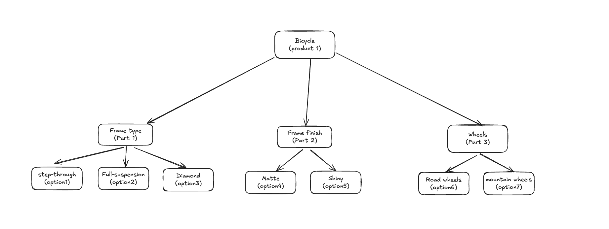
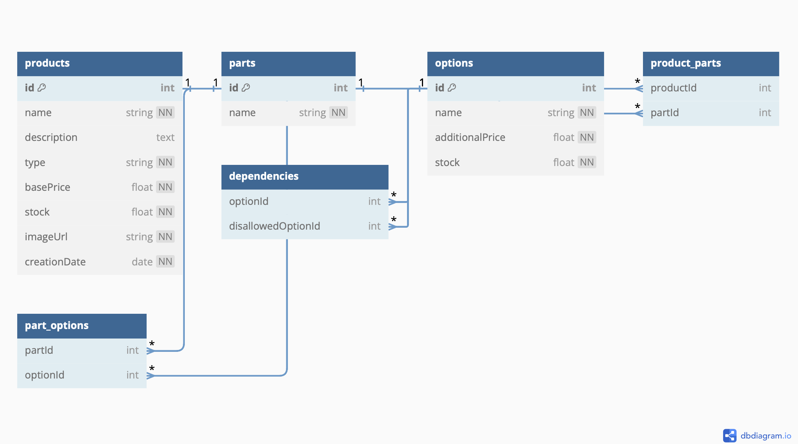

# Table of Contents

1. [Project Purpose](#project-purpose)
2. [Technologies Used](#technologies-used)
3. [Decision Making](#decision-making)
4. [Product Requirements](#product-requirements)
5. [Configuration](#configuration)

## Project Purpose

This project aims to **demonstrate my technical skills** in Fullstack web development, rather than present a fully completed application. It showcases small examples of how a project could evolve, highlighting my approach to making technical decisions and applying best practices. The focus is on my ongoing process of growth, problem-solving, and refining both code and product.

## Technologies Used

- **TypeScript**: Although I hadn't used it much before, I found it an interesting challenge to incorporate TypeScript into the project. I wanted to face somewhat complex situations and learn to solve them effectively.
- **Jest**: This is the testing library I’ve always used, both in frontend and backend. While with Vite I could have chosen Vitest, I opted for Jest because of my familiarity with it.
- **ESLint + Prettier**: Tools I always include in my projects to ensure code consistency and apply uniform formatting rules.

### Frontend

- **React**: It is the framework I have the most experience with, allowing me to progress faster and more efficiently.
- **React Testing Library**: These tools help test React components effectively.
- **Vite**: While I've worked with Webpack before, I wanted to try Vite for its speed in the build process.
- **Tailwind CSS**: It is the tool that most helps me optimize UI development time, maintaining a polished aesthetic and a usable interface without wasting time on design details.

### Backend

- **Node.js + Express**: Although I've been in PHP environments, every time I’ve developed backend functionalities, I’ve used Node, a technology with which I’m comfortable.
- **Knex.js**: Facilitates database access and transaction management.
- **SQLite**: For this project, SQLite fits perfectly with the needs. For larger projects, I’ve worked with PostgreSQL and MySQL.
- **Joi**: Used to validate API contracts, ensuring data consistency.

> [!NOTE]  
> This type of projects could also be done with NextJS, Astro, SvelteKit, as they are alternatives that allow having both the frontend and the backend in the same repository, which could make working on small projects easier.

## Decision Making

1. **Domain Modeling**  
   I started by trying to understand the product's entities and dependencies, using diagrams to visualize them more clearly.  
   

2. **Database Modeling**  
   Based on the defined entities, I created an initial draft of the database model. Although this model is iterative, it provides a solid foundation for starting to define the data that will be handled.  
   

3. **Repository Architecture**  
   Although the project is relatively small, I decided to implement a layered architecture. This decision reflects how I would approach larger, scalable projects, following best practices to facilitate maintenance and collaboration in larger teams.  
   **Advantages**:

   - **Clarity**: Each layer has a specific responsibility, making the system flow easier to understand.
   - **Scalability**: Allows adding functionalities or new development teams without making the code monolithic.
   - **Testing**: Facilitates unit and integration testing, as the layers are modular.
   - **Decoupling**: Infrastructure details are isolated, making it easy to replace them without affecting the rest of the system.

4. **Use Cases vs Hooks**  
   I opted to use **UseCases** instead of hooks to separate business logic from components. This decision aims to improve scalability and maintainability. **UseCases** allow centralizing complex logic, making it easily reusable and testable, without depending on the component lifecycle or state. This modular approach facilitates managing larger projects, where the logic's complexity grows quickly.

5. **Testing Strategy**

   **Key Principles**:

   - Test descriptions should stay focused on the **product** as much as possible, rather than the specific implementation it’s testing.
   - Prioritize **test quality** and **utility** over coverage. Avoid writing unnecessary tests that do not add value.
   - Use **givens** (fake values) or **mocks** to define values needed for each specific case. Avoid reusable mocks across multiple tests.

   #### Frontend

   - **Unit Tests**: Focused on ensuring individual components work correctly. _(e.g., `PartCustomizer.test.tsx`)_
   - **Social Unit Tests**: Test component interactions with other layers, mocking only infrastructure to observe how the component reacts to user interactions, passing through application and domain layers and their real implementation. _(e.g., `PartDetail.test.tsx`)_
   - **End-to-End Tests** (Future): Define once several features and pages are available to test complete user flows and ensure correct interaction between parts of the application.

   #### Backend

   - **Flow Tests** (Future): Validate **endpoints** to ensure they work properly and error handling is functioning as expected.
   - **Unit Tests** (Future): Implemented when they provide security and functional validation, avoiding tests solely for coverage.

## Product Requirements

The goal is to build a website for Marcus, the owner of a bicycle shop, that allows selling bicycles and other sports products in the future.

### Bicycle Customization

Customers must be able to fully customize their bicycles.

#### Acceptance Criteria:

- [x] The system allows selecting each option for every part of the bicycle.
- [x] All available customization options are shown.

### Prohibited Combinations

Some customization combinations are not possible and should be blocked.

#### Acceptance Criteria:

- [x] The system blocks incompatible part combinations.
- [ ] The system displays a message to the user about invalid combinations. _(Currently, it only has a visual alert, but a message could be implemented when hovering over the blocked option.)_

### Inventory Management

Some options may not be available in stock.

#### Acceptance Criteria:

- [x] Out-of-stock options are unavailable for customers to select.
- [ ] The system allows marking options as out of stock. _(This option would be available in the admin panel.)_

### Price Calculation

The total price of a customized bicycle is calculated by summing the price of each selected part. Some parts have a price depending on others:

#### Acceptance Criteria:

- [x] The system correctly calculates the price based on selected options.
- [ ] The system considers price dependencies between options (e.g., frame finish and frame type). _(Clarifications are still needed regarding this functionality.)_

### Future

These are future improvements and features to be added to the product:

- **Error Page for Non-Existent Product ID**: Display an error page when a product ID added in the URL does not exist.
- **UI Loader**: Implement a UI loader to show while the product information is being fetched.
- **Basic Admin Interface**: Allow the addition of new products, parts, options, and dependencies. Manage stock levels. Set base prices and combination-specific pricing.

## Configuration

To configure the project from scratch, follow these steps:

1. Clone the repository:
   ```bash
   git clone https://github.com/lele589/sports-shop.git
   cd sports-shop
   ```
2. Install dependencies:
   ```bash
   npm install
   ```
3. Create a .env file at the root of the project and add the following line:
   ```bash
   VITE_API_BASE_URL=http://localhost:3000/api
   ```
4. Start frontend server
   ```bash
   npm run dev
   ```
5. Ensure to follow the setup steps for the API repository: [sports-shop-api](https://github.com/lele589/sports-shop-api).

> [!WARNING]  
> If you encounter CORS issues, ensure the frontend server port matches the one defined in the backend repository's environment variables (`.env`).
